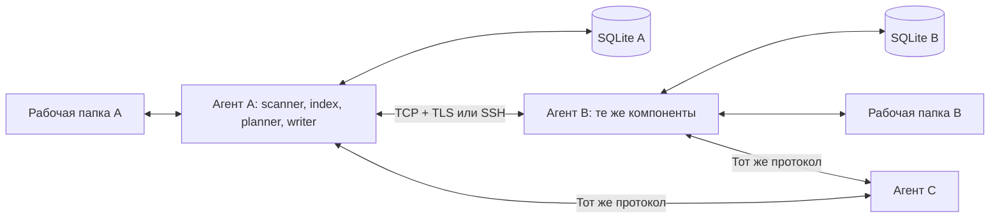

# Архитектура Backuply: анализ и предложение

Дата исходного анализа: 8 сентября 2026 года. Документ сохраняет обоснование
целевой архитектуры. После анализа выбран собственный Go-движок и реализован
первый этап; актуальные возможности и ограничения перечислены в
[README](../README.md), дальнейшие этапы — в [development.md](development.md).
Числовые параметры ниже — проектные гипотезы, а не результаты бенчмарков.

## 1. Что есть в репозитории

На момент начала анализа: четыре отслеживаемых файла, два коммита,
рабочее дерево без изменений.

| Файл | Фактическое состояние | Вывод |
| --- | --- | --- |
| `main_old/main.py` | FastAPI, один маршрут с Hello World | Только проверка запуска HTTP |
| `main_old/__init__.py` | Пустой модуль | Бизнес-логики нет |
| `requirements.txt` | FastAPI, Uvicorn, SQLAlchemy, psycopg, Pydantic без фиксации версий | SQLAlchemy и PostgreSQL-драйвер кодом не используются |
| `Dockerfile` | Python 3.12, pip install, Uvicorn | Исходная контейнеризация есть; изначально без healthcheck и отдельного UID |

Не было README, CI, тестов, конфигурации устройств, индекса файлов, наблюдателя
файловой системы, модели версий, транспорта и восстановления после сбоев.
Миграция языка сейчас не требует переноса готового движка.

В рамках анализа добавлены README, этот проект архитектуры, план разработки,
Compose и CI для существующего приложения. Dockerfile дополнен проверкой
здоровья и запуском с непривилегированным UID. Это инфраструктурный шаг.

## 2. Требуемое поведение

- Любой узел может изменять файлы, принимать изменения и раздавать уже полученные
  данные другим разрешённым участникам. Сервер отличается только временем доступности.
- Сеть без выхода в интернет — нормальный режим. Узлы догоняют изменения после
  восстановления связи. Если два устройства никогда не бывают онлайн одновременно,
  нужен третий доступный участник, успевший получить изменения.
- По умолчанию синхронизируются обычные локальные папки, доступные приложениям
  без монтирования специальной файловой системы.
- Обновления должны в итоге сходиться при прекращении записей и восстановлении
  связности. Одновременные несовместимые правки сохраняются как конфликтующие версии.
- Обрыв, перезапуск, заполнение диска и изменение исходника во время чтения
  не должны оставлять частично записанный итоговый файл.
- SSH допускается как явно настроенный альтернативный транспорт или как
  единственный разрешённый транспорт для конкретного узла.

Первая целевая платформа — Linux; далее Windows и macOS. Это порядок реализации,
а не ограничение концепции несколькими Linux-машинами. Desktop-интеграция как
у iCloud, placeholders и загрузка при открытии файла — отдельный последующий этап.

## 3. Выбор пути

| Путь | Сильная сторона | Цена и ограничения | Применение |
| --- | --- | --- | --- |
| Syncthing как отдельный движок + интерфейс Backuply | Готовая P2P-синхронизация, локальное обнаружение, обмен блоками | Зависимость от модели и интерфейсов движка; свои CDC/виртуальные файлы потребуют отдельной работы | Самый короткий путь к полезному сервису |
| Собственный движок на Go | Управление протоколом, chunking, хранением и UX | Нужно самостоятельно доказать сохранность данных и сходимость | Если собственный движок — существенная цель проекта |
| rsync через SSH + планировщик | Готовая эффективная передача разницы между двумя деревьями | Сам по себе не решает multi-master, конфликты, распространение версий | Импорт, выгрузка или направленная резервная копия |

**Рекомендация по продукту:** сначала короткий пилот на Syncthing с теми же папками,
которые предстоит синхронизировать. Если его поведения достаточно, Backuply может
управлять отдельным процессом через локальный API. Не стоит начинать с форка его
внутренностей. Syncthing обменивается метаданными и недостающими блоками между
устройствами; его BEP предусматривает TLS, векторы версий и обновления индекса.
Размер блоков фиксирован внутри отдельного файла — это не FastCDC.
[Спецификация BEP](https://docs.syncthing.net/specs/bep-v1.html).

В пилоте включить local discovery, отключить global discovery, relays и NAT traversal,
задать TCP listener и явные адреса там, где обнаружение недоступно. Опции для этого
есть в [конфигурации Syncthing](https://docs.syncthing.net/users/config.html).
Для SSH использовать туннель к TCP-порту синхронизации; найденная страница
Syncthing о туннелировании относится к GUI, поэтому не считать её инструкцией
готового SSH-транспорта данных. Механизм TCP forwarding описан в
[руководстве OpenSSH](https://man.openbsd.org/ssh).

**Рекомендация для собственного движка:** Go + локальная SQLite + TCP/TLS,
единая модель синхронизации поверх сменных транспортов. Дальнейшие разделы
описывают именно этот вариант. Автоматической совместимости с BEP у него нет.

## 4. Язык и библиотеки

| Компонент | Предложение | Причина |
| --- | --- | --- |
| Демон и CLI | Go, поддерживаемый стабильный toolchain, зафиксированный в проекте | Один исполняемый файл, удобная работа с сетью и конкурентным I/O |
| Сеть и управление | `net`, `crypto/tls`, `net/http`, `log/slog` | Стандартной библиотеки достаточно; отдельный web-фреймворк не нужен |
| Индекс | `database/sql` + `modernc.org/sqlite` | Локальная БД без сервера; драйвер без CGO |
| События файлов | `github.com/fsnotify/fsnotify` + свой рекурсивный обход и периодический rescan | События ускоряют реакцию, обход восстанавливает пропущенное |
| Метаданные протокола | `google.golang.org/protobuf` | Типизированная версионируемая схема и компактные сообщения |
| Хеш содержимого | SHA-256 из стандартной библиотеки | Минимум зависимостей; BLAKE3 рассматривать при доказанном CPU bottleneck |
| CDC | FastCDC; кандидат для проверки — `github.com/jotfs/fastcdc-go` | Повторное использование блоков после вставок и смещений |
| SSH | Системный OpenSSH, позднее встроенный адаптер при необходимости | Поддержка ключей, агента и пользовательской SSH-конфигурации |

Существование и возможности компонентов проверены по первичным источникам:
[Go TLS](https://pkg.go.dev/crypto/tls),
[SQLite-драйвер](https://pkg.go.dev/modernc.org/sqlite),
[Protobuf Go](https://pkg.go.dev/google.golang.org/protobuf),
[FastCDC Go](https://github.com/jotfs/fastcdc-go).
Выбор версии CDC-библиотеки требует проверки лицензии, тестовых векторов,
поддержки и производительности перед включением в зависимости.

Go выбран ради простоты разработки и поставки, а не из утверждения, что он всегда
быстрее Rust или Python. Rust оправдан при жёстких ограничениях RAM/CPU и опыте
команды, но увеличит начальную сложность. Python подходит для прототипа управления;
сохранять отдельный Python-сервис в целевом продукте без причины не нужно.
PostgreSQL, Redis, очередь сообщений и Kubernetes для этого масштаба не требуются.

## 5. Транспорт: основной режим и альтернативы

Не существует универсально самого быстрого протокола: важны размер файлов,
RTT, диск, CPU и число параллельных операций. Для LAN выбираем простой базовый
вариант и сравниваем его на реальных данных.

| Вариант | Решение |
| --- | --- |
| TCP + TLS 1.3 + бинарные сообщения | Основной: постоянная двунаправленная сессия, пакетирование метаданных, несколько незавершённых запросов блоков |
| Тот же протокол через SSH | Опциональный, без изменения версий, конфликтов и проверки блоков |
| QUIC | Позднее, если измерения покажут пользу на Wi-Fi с потерями или при смене сети |
| HTTP/2 streaming / gRPC | Разумная альтернатива своему framing, если команда предпочитает готовые RPC и flow control |
| SFTP / SCP | Не основной путь: сами по себе не предоставляют нашу модель блочной multi-master-синхронизации |
| FTP | Исключён по требованиям; схема с отдельными операциями/соединениями для каждого файла нам не нужна |

У TCP есть задержка всех данных потока при потере сегмента. QUIC предоставляет
независимые потоки, но сам факт использования UDP не гарантирует ускорения.
[RFC 9000](https://www.rfc-editor.org/rfc/rfc9000.html).

Предлагаемый протокол v1:

1. TLS с взаимной проверкой разрешённых ключей устройств. Первый контакт требует
   подтверждения fingerprint; объявления в LAN не являются доверием.
2. `Hello`: версия протокола, возможности и согласованные лимиты.
3. `FolderHello`: только разрешённые общей политикой папки, epoch индекса и cursor.
4. `IndexBatch` / `IndexAck`: постраничные метаданные; после reconnect только
   изменения после подтверждённого cursor, при смене epoch — полная сверка.
5. `BlockRequest(request_id, folder_id, revision, hash, size)` и `BlockResponse`:
   блоки запрашиваются у любого доверенного узла, имеющего нужную версию.
6. `Cancel`, `Ping`, структурированные ошибки и повторное соединение с backoff/jitter.

Ограниченный length-prefixed framing: версия и тип, request ID, длина, payload.
Начальный предел кадра 2 MiB, блока 1 MiB; большие манифесты разбиваются на страницы.
Проверять длины до выделения памяти и задавать предел распакованного размера.
Для данных — байтовый payload, для метаданных — Protobuf. Нужны fair scheduling,
backpressure, timeouts и ограничения и на peer, и на весь процесс.

Начать с одной сессии на пару узлов, 16 запросов в полёте и общего бюджета буферов
64 MiB на процесс. Значения настраиваемые, не гарантии оптимальности. Если два узла
соединились одновременно, выбирать одну сессию по согласованному детерминированному
правилу. Контрольные сообщения не должны голодать за потоком больших блоков.

Мелкие файлы передавать целиком, но группировать их описания/запросы и не ждать
отдельного RTT на каждый файл. Параллелизм чтения/записи ограничивать отдельно:
HDD, SSD и сетевой диск требуют разных настроек. Сжатие данных в быстрой LAN
начать с выключенного; сжатие метаданных и адаптивное сжатие данных включать по
измерениям. Не сжимать повторно уже сжатый поток по умолчанию.

### SSH

Первый вариант — адаптер, открывающий через `ssh -T -W` канал к listener демона
на loopback удалённой машины. Пример будущего транспортного вызова:

```sh
ssh -T -o BatchMode=yes -o StrictHostKeyChecking=yes \
  -i /path/to/backuply_key -W 127.0.0.1:24800 syncuser@server
```

Порт 24800 здесь — проектный пример. Сейчас такого listener нет.
Вызов открывает поток, к которому адаптер подключит протокол Backuply. Удалённый
демон должен быть установлен и запущен, а sshd — разрешать forwarding к этому
адресу. Не использовать `-N` в варианте запуска удалённой команды через stdio.
Поддержка forwarding и public-key authentication описана в
[OpenSSH](https://man.openbsd.org/ssh).

В первом варианте сохранять TLS и идентичность Backuply внутри SSH: это двойное
шифрование, зато одинаковая проверка peer во всех режимах. Если политика требует
именно единственного слоя SSH, отдельный будущий stdio-адаптер должен явно связать
SSH-ключ с Device ID и ACL папок; просто отключать проверку идентичности нельзя.
Закрытый ключ аутентифицирует пользователя, сеансовые ключи шифрования согласуются
SSH автоматически. Ключи и host fingerprints не встраиваются в Docker-образ.

Политики соединения: `direct-only`, `prefer-direct-with-ssh-fallback`, `ssh-only`.
Fallback разрешён только к заранее настроенному SSH-узлу. Ошибка проверки ключа
не является поводом обходить доверие другим каналом. В `ssh-only` запрещаются
прямые исходящие подключения и сетевой listener; допустим loopback для туннеля.
Удалённые параметры передавать без конкатенации shell-команд и без PTY.

## 6. Обнаружение и децентрализация

Для первого прототипа достаточно явных адресов. Следующий этап — mDNS/DNS-SD
`_backuply._tcp.local` в выбранных интерфейсах. В объявлении только версия,
идентификатор и порт, без путей и списка файлов. Реализацию mDNS выбрать отдельно
после проверки поддержки IPv4/IPv6 и интерфейсов на целевых ОС.

Multicast обычно ограничен сегментом сети: VLAN, VPN и Wi-Fi client isolation
могут мешать обнаружению. Поэтому статические адреса обязательны. В LAN-профиле
задаётся список разрешённых интерфейсов/CIDR: приватный IP сам по себе не доказывает
локальность, а глобальный IPv6 может принадлежать соседу в той же LAN.

Ни глобального discovery, ни relay, ни UPnP по умолчанию. Для редкого WAN-сценария —
явный доступный адрес, настроенный VPN или SSH. Работа через произвольный CGNAT
без вспомогательной инфраструктуры не обещается. Не требуется полный mesh:
разрешённые промежуточные участники распространяют принятые версии дальше,
сохраняя информацию о происхождении, а не создавая новую локальную правку.

## 7. Передача изменений и расход места

Git — полезная аналогия, но не основа протокола. Он оперирует объектами и снимками,
а delta compression применяется при упаковке объектов. Это не означает, что
автоматическая синхронизация произвольных папок должна создавать Git-коммиты.
[Git: Packfiles](https://git-scm.com/book/en/v2/Git-Internals-Packfiles).

| Алгоритм | Когда полезен | Компромисс |
| --- | --- | --- |
| Фиксированные блоки + SHA-256 | Простой первый вертикальный прототип, изменения на прежних смещениях | Вставка в начало может изменить все последующие блоки |
| rsync rolling checksum | Две похожие версии файла, в том числе со смещениями | Сигнатуры конкретной базовой версии, дополнительная работа CPU |
| Content-defined chunking / FastCDC | Повторное использование фрагментов при вставках, multi-peer обмен по хешам | Более сложное разбиение и метаданные, требуется чтение изменённого файла |

Rsync сопоставляет окна исходника с блоками получателя и передаёт совпадения
как ссылки, а несовпавшие байты — как данные.
[Описание алгоритма rsync](https://rsync.samba.org/how-rsync-works.html).
FastCDC определяет границы по содержимому, сокращая вычислительную стоимость CDC.
[Исследование FastCDC](https://www.usenix.org/conference/atc16/technical-sessions/presentation/xia).

Для собственного движка: начать проверку корректности с фиксированных блоков
256 KiB, затем добавить FastCDC до оценки выполнения требования об эффективной
передаче вставок. Начальные параметры CDC: min 64 KiB, avg 256 KiB, max 1 MiB;
файлы до 64 KiB — один блок. Алгоритм, версия и параметры входят в манифест;
границы воспроизводимы по фиксированным тестовым векторам.

Манифест: размер файла, хеш целого содержимого, упорядоченные пары `(hash, length)`
и идентификатор разбиения. Получатель ищет блоки в своих текущих файлах/временных
данных, запрашивает недостающее, проверяет каждый блок и итоговый файл. Первичная
синхронизация без локальных совпадений требует полной передачи. Сжатые или
зашифрованные форматы могут изменяться целиком от небольшой логической правки.

Пример только для оценки масштаба: файл 1 GiB с фиксированными блоками 256 KiB —
4096 блоков. Если 4 KiB перезаписаны внутри одного блока без изменения длины,
достаточно передать этот блок, если остальные уже есть у получателя; на границе —
два. Только 32-байтовые хеши полного манифеста занимают 128 KiB, дополнительно идут
длины, версии и framing. Поэтому метаданные и чтение диска тоже измеряются.

**Экономия трафика не равна экономии дискового места.** Обычная рабочая папка всё
равно содержит полные файлы. Для первого выпуска: не создавать вторую постоянную
копию всех актуальных блоков, держать индекс `(hash → path, revision, offset)`,
ограниченный кэш и временные файлы. Повторно проверять блок при чтении: его
исходный файл мог измениться. Не разделять блоки между разными ACL папок без
отдельной проверки права доступа к содержимому.

При атомарной сборке старый и временный новый файл могут одновременно занимать
до двух размеров файла плюс кэш/историю. Reflink способен уменьшить расход на
поддерживающих его ФС, но не является общей гарантией. История имеет квоту и
retention. Синхронизация сама по себе не резервная копия: удаления распространяются.

Практическая экономия места на ноутбуке начинается с выборочной синхронизации
папок и исключений. Полноценный on-demand потребует placeholders и платформенных
механизмов (Windows Cloud Files, macOS File Provider, Linux FUSE или аналог).
Это отдельный проект: потребуется хотя бы один доступный держатель полного файла;
удаление последней копии нельзя считать «освобождением кэша».

## 8. Модель состояния, конфликты и запись файлов



У каждого узла собственные `devices`, `folders`, `entries`, `manifests`,
`block_locations`, `changes`, `peer_cursors`, `pending_applies` и `conflicts`.
SQLite хранится вне синхронизируемой папки, на локальном диске, с одним владельцем
записи и транзакциями. WAL не предназначен для общей БД на сетевой ФС.
[Документация SQLite WAL](https://www.sqlite.org/wal.html).

Метаданные записи: Folder ID, относительный путь, тип, размер, portable permissions,
content/manifest hash, version vector, tombstone и локальный sequence.
Счётчик локального устройства и изменение записи фиксируются в одной транзакции;
sequence служит курсором доставки, vector — причинностью. Восстановление старой
БД требует нового incarnation/epoch, чтобы не переиспользовать счётчики версий.

Пример: после общей версии `{A:1}` два офлайн-изменения дают `{A:2}` и `{A:1,B:1}`.
Ни одна версия не старше другой причинно — это конфликт. Если одна версия
покомпонентно не меньше другой и хотя бы один счётчик больше, она новее.
`mtime` используется как подсказка сканеру, но не как правило выбора победителя.

При одинаковом содержимом объединять причинную информацию без второй копии.
При разных конкурентных версиях сохранять все недоминируемые ревизии. Один и тот
же детерминированный порядок ревизий выбирает содержимое основного пути; остальные
материализуются как conflict copies с устойчивым ID. Имена и происхождение
конфликтов должны быть идемпотентны; служебную материализацию нельзя индексировать
как новую независимую правку. Разрешение конфликта пользователем создаёт версию,
доминирующую над всеми разрешёнными ревизиями. Точный формат — обязательный RFC
до реализации multi-master. Автослияние исходников не входит в первый выпуск.

Удаление передаётся как версия-tombstone. При конкурентном delete/edit сохранить
изменённые данные и показать конфликт удаления. Tombstone нельзя удалять просто
через 30 дней: выключенный ноутбук может вернуть старый файл. Удалять его можно
после подтверждений всех активных участников и согласованного checkpoint;
исключённый участник при возвращении проходит повторную сверку/подключение.
Отсутствующий корень, ошибка доступа или отключённый диск останавливают папку,
а не интерпретируются как удаление всего дерева. Использовать marker папки.

Переименование в v1 — delete + create, с повторным использованием тех же блоков.
Нативные rename-операции и разрешение concurrent rename добавлять позднее.

Применение файла:

1. Сканер читает стабильную версию: открытый handle, stat до/после, проверка хеша,
   retry при изменении. Для строгого снимка активно записываемых данных нужны
   остановка writer или snapshot ФС; stat сам по себе этого не гарантирует.
2. Получатель записывает проверенные блоки во временный файл на той же ФС и
   сохраняет прогресс, привязанный к конкретному manifest/revision.
3. Перед заменой повторно проверяет, что локальная версия не изменилась. При
   изменении — повторное планирование/конфликт, без молчаливого затирания.
4. Проверяет итоговый хеш, выполняет flush/fsync, атомарную замену и синхронизацию
   каталога там, где она поддерживается. Только затем подтверждает применение.
5. Журнал `pending_applies` позволяет восстановиться между rename и commit БД:
   единой транзакции между файловой системой и SQLite нет.

На произвольной ФС нельзя абсолютно исключить гонку с внешним приложением между
последней проверкой и заменой. Нужны сохранение вытесняемой версии, платформенные
примитивы и явный режим quiesce/snapshot для строгих гарантий. Временные данные
никогда не выдаются пользователю под итоговым именем. Гарантия v1 — на файл;
транзакционный снимок сразу всего проекта — отдельная возможность.

Watcher объединяет частые события и повторно сканирует после overflow и reconnect.
Полный периодический обход остаётся обязательным, в том числе аудит хешей для
изменений с сохранёнными size/mtime. `fsnotify` не добавляет рекурсивные watches
автоматически и имеет ограничения на сетевых ФС.
[Документация fsnotify](https://github.com/fsnotify/fsnotify).

Пути проверять относительно открытого корня, защищая и от `..`, и от symlink races.
В v1 передавать обычные файлы/каталоги; symlinks, special files, hardlink semantics,
xattrs и ACL явно обозначить как неподдерживаемые до отдельных тестов. На Windows
и macOS нужны проверки case collisions, Unicode и запрещённых имён; коллизия
должна останавливать конкретную запись с объяснением, а не затирать другой файл.

Для папок проектов предложить настраиваемые исключения: `node_modules`, `.venv`,
build-каталоги и временные файлы редакторов. Исключённое локально не означает
удалённое на peers. Не включать скрытые файлы в игнор автоматически. Одновременную
синхронизацию изменяемой `.git` и работающих БД не считать согласованным снимком:
для них нужны отдельная политика, Git remote или snapshot/quiesce соответственно.

## 9. Что считать доказательством эффективности

Сравнивать одинаковые наборы данных, транспортную защиту и диски: Syncthing TCP,
rsync через SSH, полное копирование и Backuply. Измерять файлы/с, p50/p95 времени
от сохранения до применения, payload и общий сетевой трафик, CPU/RSS, байты
прочитанные/записанные диском, размер индекса и пиковое временное место.

Для 1 GbE теоретический предел полезных данных ниже 125 MB/s уже из-за накладных
расходов; это не целевой результат для мелких файлов. Для них важнее отсутствие
RTT на файл и стоимость операций ФС. Нельзя обещать процент экономии без данных:
полная пересборка архива или маленький исходник могут потребовать полной передачи.
Подробная матрица сценариев и этапы — в [плане разработки](development.md).
